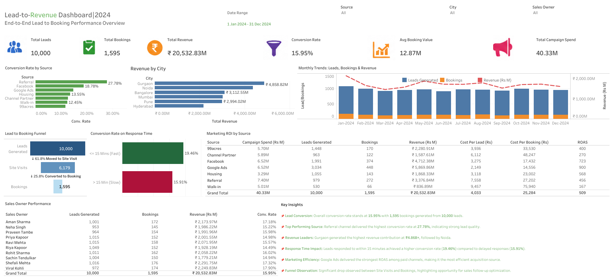

**Lead-to-Revenue Performance Dashboard**

**Project Overview:**
This project presents an interactive Tableau dashboard designed to analyze the complete lead-to-booking lifecycle across marketing campaigns, cities, and sales teams.
The dashboard focuses on conversion analysis, revenue tracking, campaign ROI measurement, funnel performance, and response-time impact analysis.

**Dashboard Features:**
KPI Tracking
Revenue \& Conversion Analysis
Marketing ROI \& ROAS Analysis
Lead-to-Booking Funnel
Monthly Performance Trends
Response Time Impact Analysis
Dynamic Filters \& Interactivity
Sales Owner Performance Tracking

**Tools \& Technologies Used**:

Tableau,
Python,
ChatGPT-assisted synthetic dataset generation &
Excel / CSV

**Dataset Information:**
The dataset used in this project is a synthetic business dataset generated using Python for portfolio and learning purposes.

**Key Insights:**
Referral channels delivered the highest conversion rate.
Faster lead response times improved booking conversions.
Google Ads generated the strongest ROAS among paid channels.
Significant drop-off observed between Site Visits and Bookings.

**Screenshot:**

Tableau Public

https://public.tableau.com/views/Lead-to-RevenuePerformanceDashboardMarketingAnalytics/Lead-Revenue\_Dashboard?:language=en-US\&publish=yes\&:sid=\&:redirect=auth\&:display\_count=n\&:origin=viz\_share\_link

